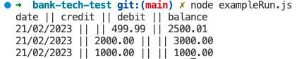

# Practice Bank Tech Test

This app allows a user to make deposits and withdrawals to a bank account as well as printing a statement to show a history of transactions with data including the date the transaction was made, the amount (whether credit or debit) and a balance. 

Interaction of the app is conducted through the Node REPL.

## Installation and Dependencies

* Node is required to run this program.
* To install dependencies, run `npm install`.
* To run tests and see test coverage, run `npm test`.

## Running the App

The REPL environment can be started by running `node` in the console.

Try the following commands to test out the functionality:

```js
const AccountModel = require('./accountModel');
const AccountView = require('./accountView');

const account = new AccountModel();
account.deposit(1000.00);
account.deposit(2000.00);
account.withdraw(499.99);

const accountView = new AccountView(account);
accountView.printStatement();
```
This is printed to the terminal:
```
date || credit || debit || balance
21/02/2023 || || 499.99 || 2500.01
21/02/2023 || 2000.00 || || 3000.00
21/02/2023 || 1000.00 || || 1000.00
```
Or run `node exampleRun.js` in the console and see the same result:



## Approach to Code Design

Test driven development was used from the inception, following the red, green, refactor process. Commits were made after every passed test to track this. Both classes are unit tested with any dependencies mocked and a integration test also features. The code has been kept DRY with as much code refactored into seperate methods as made sense for reusability and readability. 

The idea behind the code design was to make the user interface as simple as possible with most of the work going on behind the scenes. Dates were mocked to test the model class to ensure that the requirement of transactions being made on different days was met. The app also throws an error if transactions with negative amounts are tried as well as any smaller fractions than a penny.

## Code Structure

An account model was created to start with, allowing the creation of a new account and get balance function to allow the balance to be retrieved. Functionality was added to deposit and withdraw amounts from the account, followed by a way of recording the transactions with the date made. The logic was kept in the model class and a view class was created for formatting the saved transactions into the required statement format.